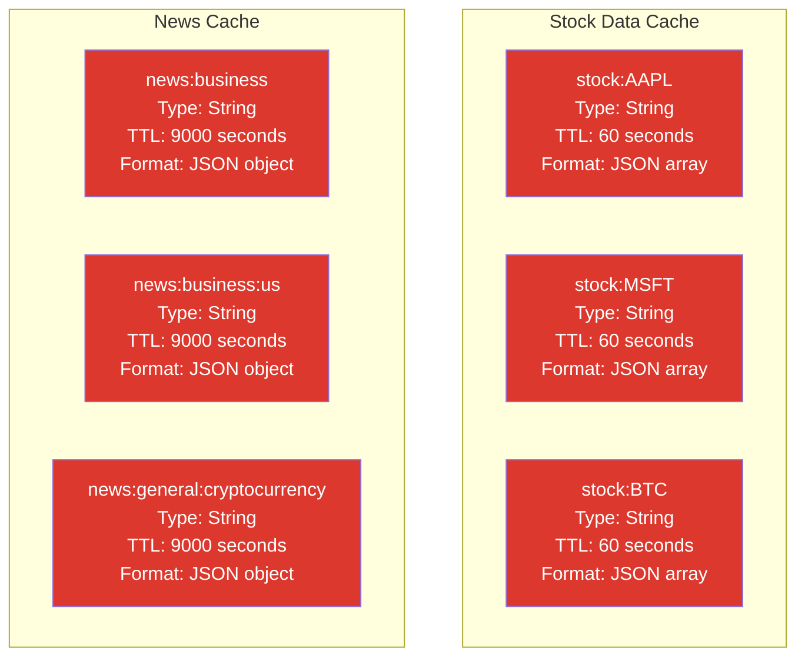

# Complete Database Schema Documentation

## PostgreSQL Database Schema (with TimescaleDB)

### Entity Relationship Diagram

```mermaid
erDiagram
    users ||--o{ watchlist : "has"
    asset_info ||--o{ asset_data : "references"
    asset_info ||--o{ watchlist : "references"
    
    users {
        serial id PK
        varchar email UK "UNIQUE NOT NULL"
        varchar password_hash
        varchar auth_type "CHECK: 'custom', 'google', 'both'"
        varchar google_id UK "UNIQUE"
        varchar name
        timestamp created_at "DEFAULT CURRENT_TIMESTAMP"
        timestamp updated_at "DEFAULT CURRENT_TIMESTAMP"
        boolean is_admin "DEFAULT FALSE"
        boolean is_superuser "DEFAULT FALSE"
    }
    
    asset_info {
        varchar symbol PK "UNIQUE"
        varchar name
        varchar type "stock, crypto, etf, etc."
        varchar exchange
        varchar currency "DEFAULT 'USD'"
        numeric market_cap
        numeric pe_ratio
        numeric dividend_yield
        timestamp updated_at "DEFAULT CURRENT_TIMESTAMP"
    }
    
    asset_data {
        varchar symbol PK "Composite PK"
        date date PK "Composite PK, TimescaleDB dimension"
        numeric open "NUMERIC(18,8)"
        numeric high "NUMERIC(18,8)"
        numeric low "NUMERIC(18,8)"
        numeric close "NUMERIC(18,8)"
        bigint volume
        numeric adjusted_close "NUMERIC(18,8)"
    }
    
    watchlist {
        integer user_id PK "Composite PK, FK -> users.id"
        varchar symbol PK "Composite PK, FK -> asset_info.symbol"
        timestamp added_at "DEFAULT CURRENT_TIMESTAMP"
    }
    
    note right of asset_data
        TimescaleDB Hypertable Configuration:
        - Extension: timescaledb
        - Chunk interval: 30 days
        - Compression: Enabled
        - Compression segmentby: symbol
        - Compression orderby: date
        - Compression policy: 7 days
        - Automatic partitioning by date
        - 90%+ compression ratio
    end note
```

---

## Table Definitions

### 1. `users` Table

**Purpose**: User authentication and profile management

```sql
CREATE TABLE users (
    id SERIAL PRIMARY KEY,
    email VARCHAR(255) UNIQUE NOT NULL,
    password_hash VARCHAR(255),
    auth_type VARCHAR(50) NOT NULL CHECK (auth_type IN ('custom', 'google', 'both')),
    google_id VARCHAR(255) UNIQUE,
    name VARCHAR(255),
    created_at TIMESTAMP DEFAULT CURRENT_TIMESTAMP,
    updated_at TIMESTAMP DEFAULT CURRENT_TIMESTAMP,
    is_admin BOOLEAN DEFAULT FALSE,
    is_superuser BOOLEAN DEFAULT FALSE
);
```

**Columns**:
| Column | Type | Constraints | Description |
|--------|------|-------------|-------------|
| `id` | SERIAL | PRIMARY KEY | Auto-incrementing user ID |
| `email` | VARCHAR(255) | UNIQUE, NOT NULL | User email address |
| `password_hash` | VARCHAR(255) | NULL | Bcrypt hashed password (NULL for Google-only users) |
| `auth_type` | VARCHAR(50) | NOT NULL, CHECK | 'custom', 'google', or 'both' |
| `google_id` | VARCHAR(255) | UNIQUE | Google OAuth ID (NULL for custom auth only) |
| `name` | VARCHAR(255) | NULL | User's display name |
| `created_at` | TIMESTAMP | DEFAULT CURRENT_TIMESTAMP | Account creation timestamp |
| `updated_at` | TIMESTAMP | DEFAULT CURRENT_TIMESTAMP | Last update timestamp |
| `is_admin` | BOOLEAN | DEFAULT FALSE | Admin privileges flag |
| `is_superuser` | BOOLEAN | DEFAULT FALSE | Superuser privileges flag |

**Indexes**:
- Primary Key: `id`
- Unique Index: `email`
- Unique Index: `google_id`

---

### 2. `asset_info` Table

**Purpose**: Asset metadata (stocks, crypto, ETFs, etc.)

```sql
CREATE TABLE asset_info (
    symbol VARCHAR(50) PRIMARY KEY,
    name VARCHAR(255),
    type VARCHAR(50),
    exchange VARCHAR(100),
    currency VARCHAR(10) DEFAULT 'USD',
    market_cap NUMERIC,
    pe_ratio NUMERIC,
    dividend_yield NUMERIC,
    updated_at TIMESTAMP DEFAULT CURRENT_TIMESTAMP
);
```

**Columns**:
| Column | Type | Constraints | Description |
|--------|------|-------------|-------------|
| `symbol` | VARCHAR(50) | PRIMARY KEY | Asset ticker symbol (e.g., 'AAPL', 'BTC') |
| `name` | VARCHAR(255) | NULL | Full asset name |
| `type` | VARCHAR(50) | NULL | Asset type: 'stock', 'crypto', 'etf', etc. |
| `exchange` | VARCHAR(100) | NULL | Trading exchange (e.g., 'NASDAQ', 'NYSE') |
| `currency` | VARCHAR(10) | DEFAULT 'USD' | Trading currency |
| `market_cap` | NUMERIC | NULL | Market capitalization |
| `pe_ratio` | NUMERIC | NULL | Price-to-earnings ratio |
| `dividend_yield` | NUMERIC | NULL | Dividend yield percentage |
| `updated_at` | TIMESTAMP | DEFAULT CURRENT_TIMESTAMP | Last metadata update |

**Indexes**:
- Primary Key: `symbol`

---

### 3. `asset_data` Table (TimescaleDB Hypertable)

**Purpose**: Historical OHLCV (Open, High, Low, Close, Volume) price data

```sql
CREATE TABLE asset_data (
    symbol VARCHAR(50) NOT NULL,
    date DATE NOT NULL,
    open NUMERIC(18,8),
    high NUMERIC(18,8),
    low NUMERIC(18,8),
    close NUMERIC(18,8),
    volume BIGINT,
    adjusted_close NUMERIC(18,8),
    PRIMARY KEY (symbol, date)
);
```

**TimescaleDB Configuration**:
```sql
-- Enable TimescaleDB extension
CREATE EXTENSION IF NOT EXISTS timescaledb;

-- Convert to hypertable
SELECT create_hypertable(
    'asset_data',
    'date',
    chunk_time_interval => INTERVAL '30 days',
    if_not_exists => TRUE
);

-- Enable compression
ALTER TABLE asset_data SET (
    timescaledb.compress,
    timescaledb.compress_segmentby = 'symbol',
    timescaledb.compress_orderby = 'date'
);

-- Add compression policy (compress data older than 7 days)
SELECT add_compression_policy('asset_data', INTERVAL '7 days');
```

**Columns**:
| Column | Type | Constraints | Description |
|--------|------|-------------|-------------|
| `symbol` | VARCHAR(50) | PRIMARY KEY (composite) | Asset ticker symbol |
| `date` | DATE | PRIMARY KEY (composite) | Trading date (TimescaleDB dimension) |
| `open` | NUMERIC(18,8) | NULL | Opening price |
| `high` | NUMERIC(18,8) | NULL | Highest price of the day |
| `low` | NUMERIC(18,8) | NULL | Lowest price of the day |
| `close` | NUMERIC(18,8) | NULL | Closing price |
| `volume` | BIGINT | NULL | Trading volume |
| `adjusted_close` | NUMERIC(18,8) | NULL | Adjusted closing price (for splits/dividends) |

**Indexes**:
- Primary Key: `(symbol, date)` (composite)
- Automatic TimescaleDB indexes on time dimension

**TimescaleDB Features**:
- ✅ Hypertable with 30-day chunk intervals
- ✅ Compression enabled (90%+ reduction)
- ✅ Compression policy: data older than 7 days
- ✅ Automatic partitioning by date
- ✅ 10-100x faster time-series queries

---

### 4. `watchlist` Table

**Purpose**: User's watchlist of tracked assets

```sql
CREATE TABLE watchlist (
    user_id INTEGER NOT NULL,
    symbol VARCHAR(50) NOT NULL,
    added_at TIMESTAMP DEFAULT CURRENT_TIMESTAMP,
    PRIMARY KEY (user_id, symbol),
    FOREIGN KEY (user_id) REFERENCES users(id) ON DELETE CASCADE,
    FOREIGN KEY (symbol) REFERENCES asset_info(symbol) ON DELETE CASCADE
);
```

**Columns**:
| Column | Type | Constraints | Description |
|--------|------|-------------|-------------|
| `user_id` | INTEGER | PRIMARY KEY (composite), FK → users.id | Reference to user |
| `symbol` | VARCHAR(50) | PRIMARY KEY (composite), FK → asset_info.symbol | Asset symbol |
| `added_at` | TIMESTAMP | DEFAULT CURRENT_TIMESTAMP | When asset was added to watchlist |

**Indexes**:
- Primary Key: `(user_id, symbol)` (composite)
- Foreign Key: `user_id` → `users.id`
- Foreign Key: `symbol` → `asset_info.symbol`

---

## Redis Cache Schema

### Key Structure



### Redis Key Patterns

#### 1. Stock Data Cache
**Pattern**: `stock:{symbol}`

**Examples**:
- `stock:AAPL`
- `stock:MSFT`
- `stock:BTC`

**TTL**: 60 seconds (1 minute)

**Data Format**: JSON array of stock price data
```json
[
  {
    "t": 1672531200000,
    "o": 150.25,
    "h": 152.30,
    "l": 149.80,
    "c": 151.50,
    "v": 50000000
  }
]
```

**Usage**: Caches stock price data from Polygon.io API

---

#### 2. News Cache
**Pattern**: `news:{category}` or `news:{category}:{country}` or `news:{category}:{query}`

**Examples**:
- `news:business` - General business news
- `news:business:us` - US business news
- `news:general:cryptocurrency OR bitcoin OR ethereum` - Crypto news with query

**TTL**: 9000 seconds (2.5 hours)

**Data Format**: JSON object with articles array
```json
{
  "articles": [
    {
      "id": "news_business_0_1234567890",
      "title": "Stock Market Reaches New Highs",
      "description": "Market analysis...",
      "source": "Bloomberg",
      "author": "John Doe",
      "url": "https://example.com/article",
      "urlToImage": "https://example.com/image.jpg",
      "publishedAt": "2024-01-01T12:00:00Z",
      "publishedDate": "1/1/2024",
      "publishedTime": "12:00:00 PM"
    }
  ],
  "timestamp": 1234567890
}
```

**Usage**: Caches news articles from NewsAPI

---

## Database Statistics

### PostgreSQL Tables

| Table | Estimated Rows | Primary Use Case | Storage (with TimescaleDB) |
|-------|---------------|------------------|----------------------------|
| `users` | Small (< 10,000) | User authentication | ~1-5 MB |
| `asset_info` | Medium (1,000 - 10,000) | Asset metadata | ~5-50 MB |
| `asset_data` | Large (1M+ with 1,000 assets × 1,260 days) | Historical price data | ~10-15 MB (compressed) |
| `watchlist` | Small-Medium (< 100,000) | User preferences | ~1-10 MB |

**Total Estimated Storage**: ~20-80 MB (with TimescaleDB compression)

### Redis Cache

| Cache Type | Key Count | TTL | Purpose |
|------------|-----------|-----|---------|
| Stock Data | ~100-1000 active | 60s | Reduce Polygon.io API calls |
| News | ~4-10 active | 9000s | Reduce NewsAPI calls |

**Estimated Memory**: ~10-50 MB (depending on cache size)

---

## TimescaleDB Benefits

### Storage Optimization
- **90%+ compression** for time-series data
- **Automatic partitioning** by date (30-day chunks)
- **Efficient indexing** on time and symbol dimensions

### Query Performance
- **10-100x faster** than regular PostgreSQL for time-series queries
- **Parallel query execution**
- **Automatic query optimization**

### Data Management
- **Automatic compression** for old data (>7 days)
- **Data retention policies** (configurable)
- **Continuous aggregates** (pre-computed views)

---

## Migration Commands

### Enable TimescaleDB

```bash
# Run migration script
cd stock-pro/backend
node scripts/migrateToTimescaleDB.js
```

### Check TimescaleDB Status

```sql
-- Check if TimescaleDB is enabled
SELECT * FROM timescaledb_information.hypertables;

-- Check compression statistics
SELECT * FROM timescaledb_information.compressed_hypertable_stats;

-- Check chunk information
SELECT * FROM timescaledb_information.chunks;
```

---

## Sample Queries

### Get Asset Data for Date Range

```sql
SELECT date, open, high, low, close, volume
FROM asset_data
WHERE symbol = 'AAPL'
  AND date >= '2024-01-01'
  AND date <= '2024-12-31'
ORDER BY date ASC;
```

### Get User Watchlist

```sql
SELECT w.symbol, ai.name, ai.type, ai.exchange, w.added_at
FROM watchlist w
LEFT JOIN asset_info ai ON w.symbol = ai.symbol
WHERE w.user_id = 1
ORDER BY w.added_at DESC;
```

### Get Latest Price for Asset

```sql
SELECT symbol, date, close
FROM asset_data
WHERE symbol = 'AAPL'
ORDER BY date DESC
LIMIT 1;
```

---

## Connection Information

See `DATABASE_CONNECTION_INFO.md` for detailed connection instructions.

