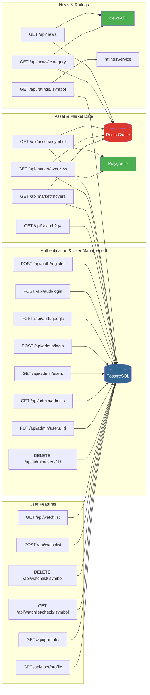
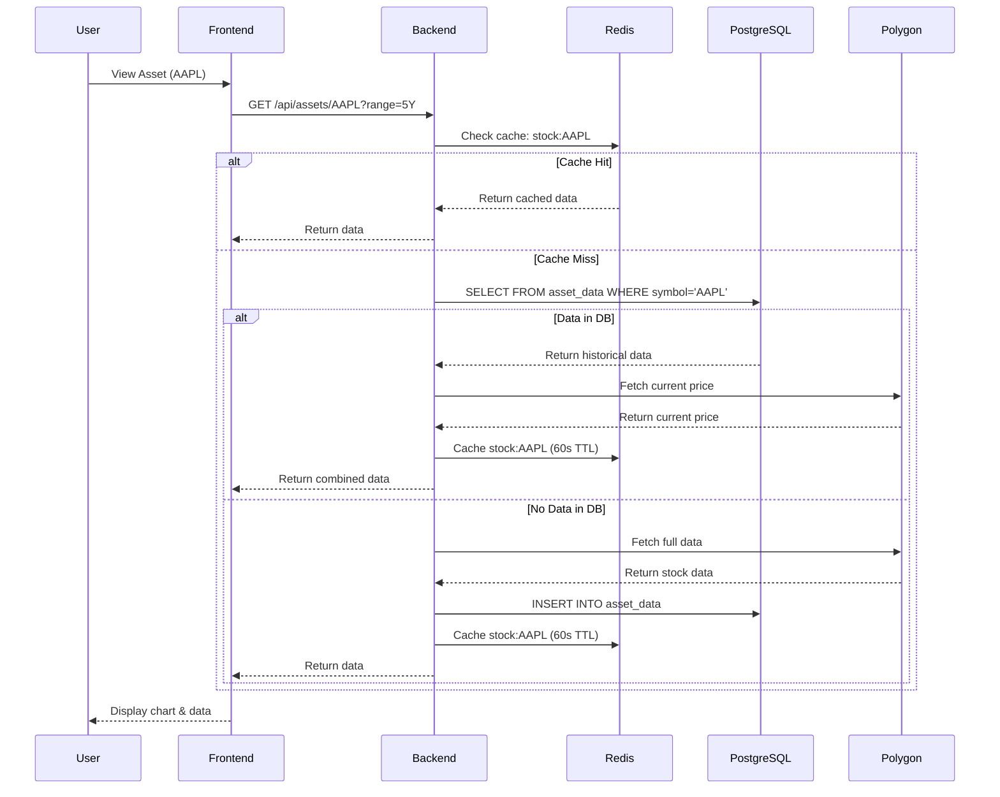
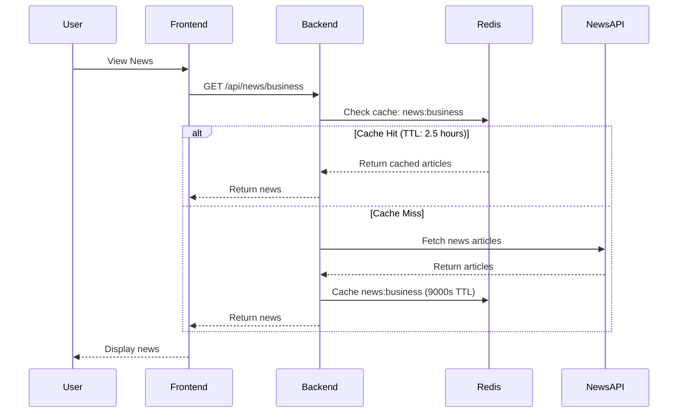
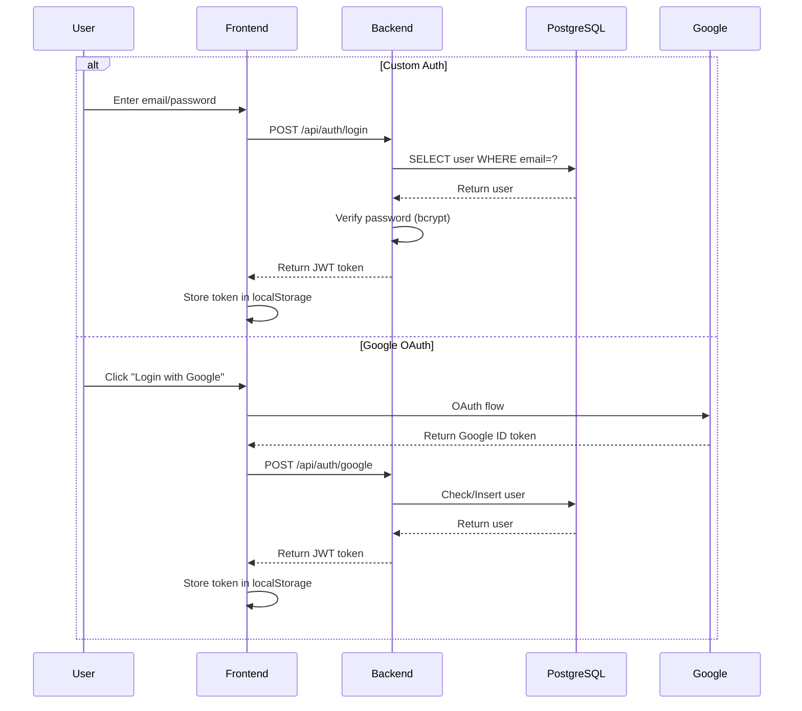
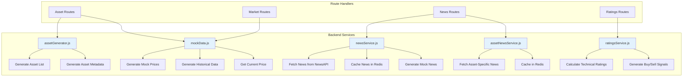
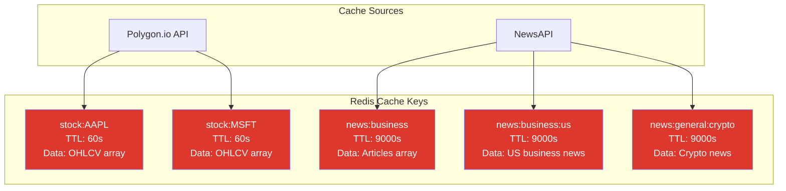
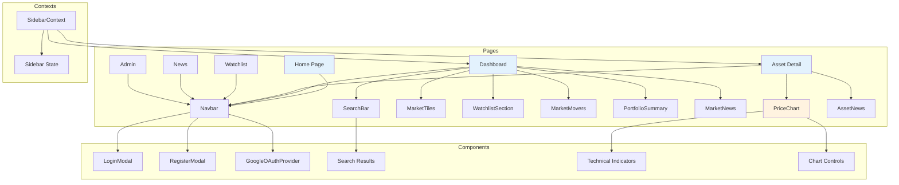

# System Architecture Visualization

## Complete System Architecture

```mermaid
graph TB
    subgraph "Frontend (Next.js - Port 3000)"
        A[Home Page] --> B[Dashboard]
        A --> C[Asset Detail]
        A --> D[Watchlist]
        A --> E[News]
        A --> F[Admin Panel]
        B --> C
        B --> D
        C --> G[PriceChart Component]
        C --> H[AssetNews Component]
        B --> I[MarketTiles]
        B --> J[SearchBar]
        B --> K[WatchlistSection]
        B --> L[MarketMovers]
        B --> M[PortfolioSummary]
        B --> N[MarketNews]
    end

    subgraph "Backend API (Express - Port 3001)"
        O[/api/auth] --> P[Auth Routes]
        Q[/api/admin] --> R[Admin Routes]
        S[/api/assets] --> T[Asset Routes]
        U[/api/watchlist] --> V[Watchlist Routes]
        W[/api/market] --> X[Market Routes]
        Y[/api/news] --> Z[News Routes]
        AA[/api/portfolio] --> AB[Portfolio Routes]
        AC[/api/ratings] --> AD[Ratings Routes]
        AE[/api/search] --> AF[Search Routes]
        AG[/api/user] --> AH[User Routes]
        AI[/api/stock/:symbol] --> AJ[Legacy Stock Route]
    end

    subgraph "Services Layer"
        T --> AK[assetGenerator.js]
        T --> AL[mockData.js]
        Z --> AM[newsService.js]
        Z --> AN[assetNewsService.js]
        AD --> AO[ratingsService.js]
    end

    subgraph "Database Layer"
        P --> AP[(PostgreSQL)]
        R --> AP
        T --> AP
        V --> AP
        X --> AP
        AB --> AP
        AD --> AP
        AF --> AP
        AH --> AP
    end

    subgraph "Cache Layer"
        T --> AQ[(Redis)]
        Z --> AQ
        X --> AQ
        AJ --> AQ
    end

    subgraph "External APIs"
        T --> AR[Polygon.io API]
        Z --> AS[NewsAPI]
        AN --> AS
        AJ --> AR
    end

    B --> O
    B --> S
    B --> W
    B --> Y
    C --> S
    C --> U
    C --> AC
    D --> U
    E --> Y
    F --> R
    A --> O

    style AP fill:#336791,color:#fff
    style AQ fill:#DC382D,color:#fff
    style AR fill:#4CAF50,color:#fff
    style AS fill:#4CAF50,color:#fff
```

---

## API Routes Architecture



---

## Data Flow Diagrams

### Asset Data Flow



### News Data Flow



### Authentication Flow



---

## Service Layer Architecture



---

## Database Schema with TimescaleDB

```mermaid
erDiagram
    users ||--o{ watchlist : "has"
    asset_info ||--o{ asset_data : "references"
    asset_info ||--o{ watchlist : "references"
    
    users {
        serial id PK
        varchar email UK "UNIQUE NOT NULL"
        varchar password_hash
        varchar auth_type "CHECK: 'custom', 'google', 'both'"
        varchar google_id UK "UNIQUE"
        varchar name
        timestamp created_at "DEFAULT CURRENT_TIMESTAMP"
        timestamp updated_at "DEFAULT CURRENT_TIMESTAMP"
        boolean is_admin "DEFAULT FALSE"
        boolean is_superuser "DEFAULT FALSE"
    }
    
    asset_info {
        varchar symbol PK "UNIQUE"
        varchar name
        varchar type "stock, crypto, etf, etc."
        varchar exchange
        varchar currency "DEFAULT 'USD'"
        numeric market_cap
        numeric pe_ratio
        numeric dividend_yield
        timestamp updated_at "DEFAULT CURRENT_TIMESTAMP"
    }
    
    asset_data {
        varchar symbol PK "Composite PK"
        date date PK "Composite PK, TimescaleDB dimension"
        numeric open "NUMERIC(18,8)"
        numeric high "NUMERIC(18,8)"
        numeric low "NUMERIC(18,8)"
        numeric close "NUMERIC(18,8)"
        bigint volume
        numeric adjusted_close "NUMERIC(18,8)"
    }
    
    watchlist {
        integer user_id PK "Composite PK, FK -> users.id"
        varchar symbol PK "Composite PK, FK -> asset_info.symbol"
        timestamp added_at "DEFAULT CURRENT_TIMESTAMP"
    }
    
    note right of asset_data
        TimescaleDB Hypertable
        - Chunk interval: 30 days
        - Compression enabled
        - Compression policy: 7 days
        - Automatic partitioning by date
    end note
```

---

## Redis Cache Structure



---

## Component Architecture (Frontend)



---

## Technology Stack

### Frontend
- **Framework**: Next.js 16.1.1 (App Router)
- **Language**: TypeScript
- **Styling**: Tailwind CSS 4
- **Charts**: Lightweight Charts 5.1.0
- **OAuth**: @react-oauth/google 0.13.4
- **Indicators**: technicalindicators 3.1.0

### Backend
- **Runtime**: Node.js
- **Framework**: Express 5.2.1
- **Database**: PostgreSQL 15 (with TimescaleDB)
- **Cache**: Redis (alpine)
- **Auth**: JWT (jsonwebtoken), bcryptjs
- **HTTP Client**: axios

### External Services
- **Stock Data**: Polygon.io API
- **News**: NewsAPI

---

## Port Configuration

```
Frontend:  http://localhost:3000
Backend:   http://localhost:3001
PostgreSQL: localhost:5432
Redis:     localhost:6379
```

---

## Environment Variables

### Backend (.env)
```env
# Database
DB_HOST=localhost
DB_PORT=5432
DB_NAME=stockdb
DB_USER=user
DB_PASSWORD=password

# JWT
JWT_SECRET=your-secret-key-change-in-production

# APIs
POLYGON_API_KEY=your_polygon_api_key
NEWS_API_KEY=your_newsapi_key

# Google OAuth
GOOGLE_CLIENT_ID=your_google_client_id
GOOGLE_CLIENT_SECRET=your_google_client_secret

# Environment
NODE_ENV=development
USE_MOCK_DATA=true
```

### Frontend (.env.local)
```env
NEXT_PUBLIC_GOOGLE_CLIENT_ID=your_google_client_id
```

---

## Request Flow Summary

1. **User Request** → Frontend (Next.js)
2. **API Call** → Backend (Express) on port 3001
3. **Cache Check** → Redis (if applicable)
4. **Database Query** → PostgreSQL (if needed)
5. **External API** → Polygon.io or NewsAPI (if cache miss)
6. **Response** → Backend → Frontend → User

---

## Key Features

✅ **Authentication**: Custom auth + Google OAuth  
✅ **Real-time Data**: Stock prices and market data  
✅ **Historical Data**: 5 years of OHLCV data (TimescaleDB)  
✅ **Caching**: Redis for stock data (60s) and news (2.5h)  
✅ **Charts**: Interactive price charts with 100+ indicators  
✅ **Watchlist**: User-specific asset tracking  
✅ **News**: Market and asset-specific news  
✅ **Ratings**: Technical analysis ratings  
✅ **Admin Panel**: User management system  

