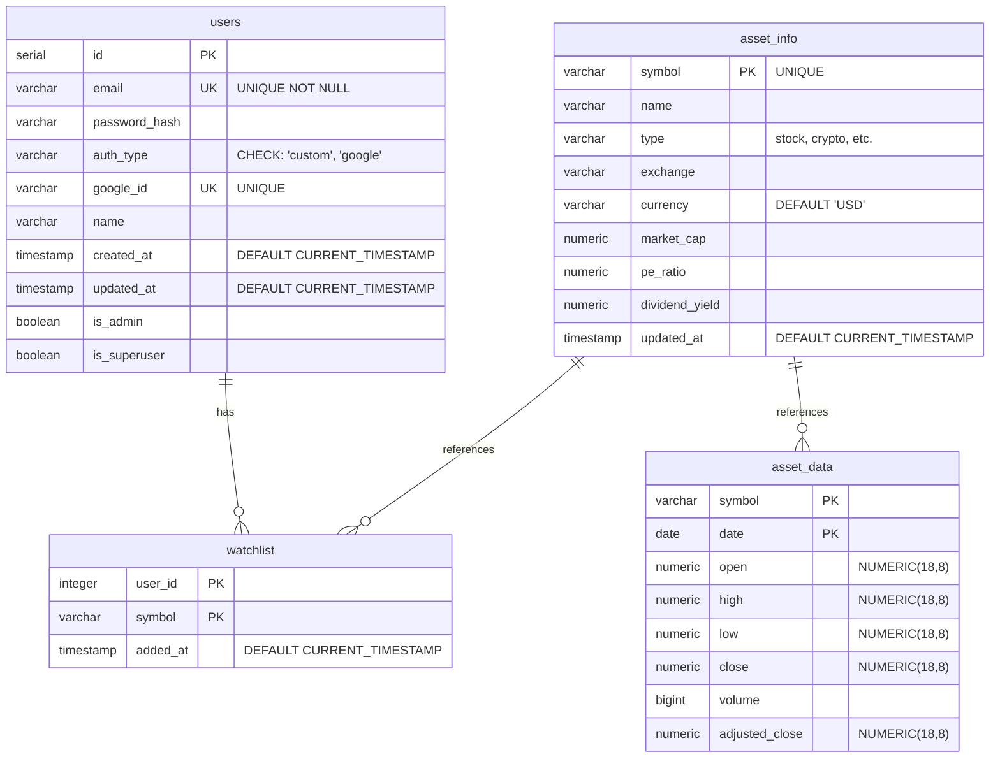
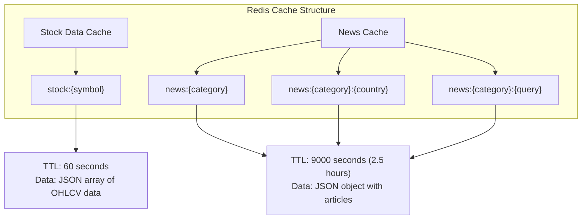
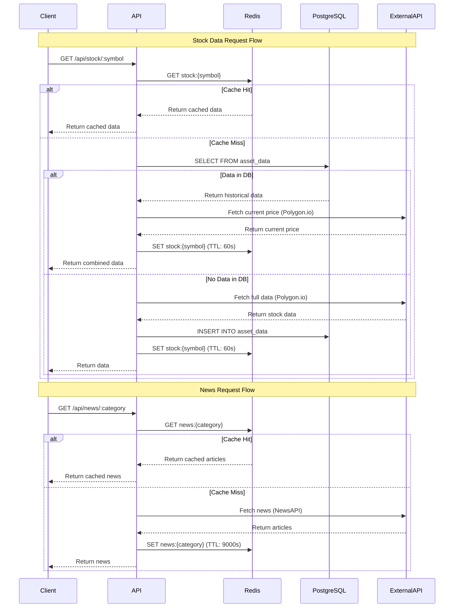

# Database Visualization

This document provides visual representations of the PostgreSQL and Redis database schemas used in the Stock App.

## PostgreSQL Database Schema

### Entity Relationship Diagram



### Table Details

#### 1. `users` Table
**Purpose**: Stores user authentication and profile information

| Column | Type | Constraints | Description |
|--------|------|-------------|-------------|
| `id` | SERIAL | PRIMARY KEY | Auto-incrementing user ID |
| `email` | VARCHAR(255) | UNIQUE, NOT NULL | User email address |
| `password_hash` | VARCHAR(255) | NULL | Bcrypt hashed password (NULL for Google-only users) |
| `auth_type` | VARCHAR(50) | NOT NULL, CHECK | Authentication type: 'custom', 'google', or 'both' |
| `google_id` | VARCHAR(255) | UNIQUE | Google OAuth ID (NULL for custom auth only) |
| `name` | VARCHAR(255) | NULL | User's display name |
| `created_at` | TIMESTAMP | DEFAULT CURRENT_TIMESTAMP | Account creation timestamp |
| `updated_at` | TIMESTAMP | DEFAULT CURRENT_TIMESTAMP | Last update timestamp |
| `is_admin` | BOOLEAN | DEFAULT FALSE | Admin privileges flag |
| `is_superuser` | BOOLEAN | DEFAULT FALSE | Superuser privileges flag |

**Indexes:**
- Primary Key: `id`
- Unique Index: `email`
- Unique Index: `google_id`

---

#### 2. `asset_info` Table
**Purpose**: Stores metadata about financial assets (stocks, crypto, etc.)

| Column | Type | Constraints | Description |
|--------|------|-------------|-------------|
| `symbol` | VARCHAR(50) | PRIMARY KEY | Asset ticker symbol (e.g., 'AAPL', 'BTC') |
| `name` | VARCHAR(255) | NULL | Full asset name |
| `type` | VARCHAR(50) | NULL | Asset type: 'stock', 'crypto', 'etf', etc. |
| `exchange` | VARCHAR(100) | NULL | Trading exchange (e.g., 'NASDAQ', 'NYSE') |
| `currency` | VARCHAR(10) | DEFAULT 'USD' | Trading currency |
| `market_cap` | NUMERIC | NULL | Market capitalization |
| `pe_ratio` | NUMERIC | NULL | Price-to-earnings ratio |
| `dividend_yield` | NUMERIC | NULL | Dividend yield percentage |
| `updated_at` | TIMESTAMP | DEFAULT CURRENT_TIMESTAMP | Last metadata update |

**Indexes:**
- Primary Key: `symbol`

---

#### 3. `asset_data` Table
**Purpose**: Stores historical OHLCV (Open, High, Low, Close, Volume) price data

| Column | Type | Constraints | Description |
|--------|------|-------------|-------------|
| `symbol` | VARCHAR(50) | PRIMARY KEY (composite) | Asset ticker symbol |
| `date` | DATE | PRIMARY KEY (composite) | Trading date |
| `open` | NUMERIC(18,8) | NULL | Opening price |
| `high` | NUMERIC(18,8) | NULL | Highest price of the day |
| `low` | NUMERIC(18,8) | NULL | Lowest price of the day |
| `close` | NUMERIC(18,8) | NULL | Closing price |
| `volume` | BIGINT | NULL | Trading volume |
| `adjusted_close` | NUMERIC(18,8) | NULL | Adjusted closing price (for splits/dividends) |

**Indexes:**
- Primary Key: `(symbol, date)` (composite)
- Can be converted to TimescaleDB hypertable for time-series optimization

**TimescaleDB Features** (if enabled):
- Hypertable with 30-day chunk intervals
- Compression enabled (90%+ reduction)
- Compression policy: data older than 7 days
- Automatic partitioning by date

---

#### 4. `watchlist` Table
**Purpose**: Stores user's watchlist of tracked assets

| Column | Type | Constraints | Description |
|--------|------|-------------|-------------|
| `user_id` | INTEGER | PRIMARY KEY (composite), FK → users.id | Reference to user |
| `symbol` | VARCHAR(50) | PRIMARY KEY (composite), FK → asset_info.symbol | Asset symbol |
| `added_at` | TIMESTAMP | DEFAULT CURRENT_TIMESTAMP | When asset was added to watchlist |

**Indexes:**
- Primary Key: `(user_id, symbol)` (composite)
- Foreign Key: `user_id` → `users.id`
- Foreign Key: `symbol` → `asset_info.symbol`

---

## Redis Cache Schema

### Redis Key Structure

Redis is used as a caching layer to improve performance and reduce API calls.



### Cache Keys

#### 1. Stock Data Cache
**Pattern**: `stock:{symbol}`

**Example Keys:**
- `stock:AAPL`
- `stock:MSFT`
- `stock:BTC`

**TTL**: 60 seconds (1 minute)

**Data Format**: JSON array of stock price data
```json
[
  {
    "t": 1672531200000,
    "o": 150.25,
    "h": 152.30,
    "l": 149.80,
    "c": 151.50,
    "v": 50000000
  },
  ...
]
```

**Usage**: Caches stock price data from Polygon.io API to reduce API calls and improve response times.

---

#### 2. News Cache
**Pattern**: `news:{category}` or `news:{category}:{country}` or `news:{category}:{query}`

**Example Keys:**
- `news:business` - General business news
- `news:business:us` - US business news
- `news:general:cryptocurrency OR bitcoin OR ethereum` - Crypto news with query
- `news:general` - General headlines

**TTL**: 9000 seconds (2.5 hours)

**Data Format**: JSON object with articles array
```json
{
  "articles": [
    {
      "id": "news_business_0_1234567890",
      "title": "Stock Market Reaches New Highs",
      "description": "Market analysis...",
      "source": "Bloomberg",
      "author": "John Doe",
      "url": "https://example.com/article",
      "urlToImage": "https://example.com/image.jpg",
      "publishedAt": "2024-01-01T12:00:00Z",
      "publishedDate": "1/1/2024",
      "publishedTime": "12:00:00 PM"
    },
    ...
  ],
  "timestamp": 1234567890
}
```

**Usage**: Caches news articles from NewsAPI to reduce API calls and improve performance.

---

## Data Flow Diagram



---

## Database Statistics

### PostgreSQL Tables

| Table | Estimated Rows | Primary Use Case |
|-------|---------------|------------------|
| `users` | Small (< 10,000) | User authentication |
| `asset_info` | Medium (1,000 - 10,000) | Asset metadata |
| `asset_data` | Large (1M+ with 1,000 assets × 1,260 days) | Historical price data |
| `watchlist` | Small-Medium (< 100,000) | User preferences |

### Redis Cache

| Cache Type | Key Count | TTL | Purpose |
|------------|-----------|-----|---------|
| Stock Data | ~100-1000 active | 60s | Reduce Polygon.io API calls |
| News | ~4-10 active | 9000s | Reduce NewsAPI calls |

---

## Optimization Features

### PostgreSQL (TimescaleDB)

1. **Hypertable**: `asset_data` can be converted to a TimescaleDB hypertable
   - Automatic partitioning by date (30-day chunks)
   - 10-100x faster time-series queries
   - Automatic data retention policies

2. **Compression**: 
   - 90%+ storage reduction
   - Data older than 7 days automatically compressed
   - Transparent decompression on query

3. **Indexes**:
   - Composite primary key on `(symbol, date)`
   - Automatic indexing on time dimension

### Redis

1. **Short TTL for Stock Data**: 60 seconds ensures fresh data while reducing API calls
2. **Long TTL for News**: 2.5 hours balances freshness with API rate limits
3. **Graceful Degradation**: Application continues to work if Redis is unavailable

---

## Connection Details

### PostgreSQL
- **Host**: `localhost` (or from `DB_HOST` env var)
- **Port**: `5432` (or from `DB_PORT` env var)
- **Database**: `stockdb` (or from `DB_NAME` env var)
- **User**: `user` (or from `DB_USER` env var)
- **Password**: `password` (or from `DB_PASSWORD` env var)

### Redis
- **Host**: `localhost`
- **Port**: `6379`
- **URL**: `redis://localhost:6379`
- **Connection**: Graceful fallback if unavailable

---

## Migration Notes

1. **TimescaleDB Migration**: Run `node backend/scripts/migrateToTimescaleDB.js` to enable hypertable features
2. **Data Population**: Run `node backend/scripts/populateAssets.js` to populate initial asset data
3. **Schema Initialization**: Schema is automatically created on first connection via `initDb()` in `db.js`

